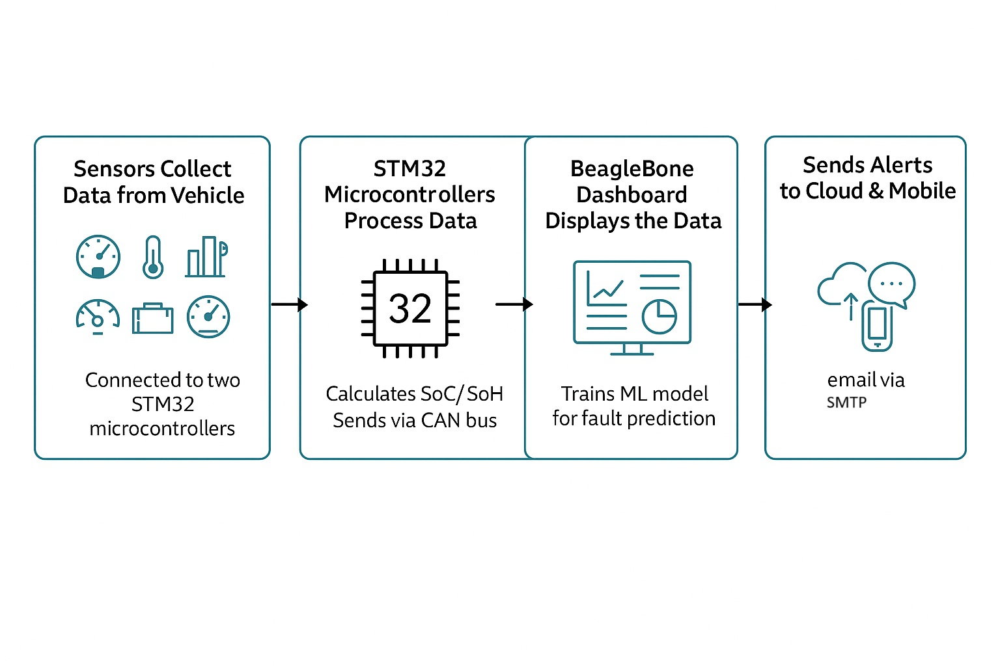

# CAN-based Smart Vehicle Sub-system: Simulation and Diagnostics

This project demonstrates a smart vehicle sub-system designed for simulating and diagnosing key automotive parameters using the Controller Area Network (CAN) protocol. It integrates embedded systems, sensor data acquisition, real-time data logging, machine learning-based fault detection, and IoT-based remote monitoring.

## Table of Contents

- [Overview](#overview)
- [System Architecture](#system-architecture)
- [Hardware Components](#hardware-components)
- [Project Workflow](#project-workflow)
- [Data Flow](#data-flow)
- [Features](#features)
- [Machine Learning Fault Detection](#machine-learning-fault-detection)
- [Cloud and Dashboard Integration](#cloud-and-dashboard-integration)
- [Technologies Used](#technologies-used)
- [Folder Structure](#folder-structure)
- [Installation & Setup](#installation--setup)
- [Running the Project](#running-the-project)
- [Future Improvements](#future-improvements)

## Overview

The system is built using three CAN nodes:

- **Node-1 (STM32F407)** for engine-related data
- **Node-2 (STM32F407)** for battery-related data
- **Node-3 (BeagleBone Black)** acting as the central controller and CAN-to-Internet gateway

Each node collects specific sensor data, transmits it over the CAN bus, and allows for real-time monitoring, fault detection, and remote visualization via a Flask dashboard and MQTT-enabled cloud dashboard.

## System Architecture


### Block Diagram


### Connection Diagram


### Data Flow Architecture

```
[LM35, Hall Sensor] --> Node-1 (STM32F407) --> MCP2551
                                             ↓
             MCP2551 <-- Node-2 (STM32F407) <-- INA219, LM35, Motor Control
                            ↓
               SN65HVD230 CAN Transceiver
                            ↓
                BeagleBone Black (Node-3)
                            ↓
        Flask Dashboard | MQTT (ThingsBoard) | CSV Logging | ML Model
```

## Hardware Components

- **STM32F407VGT6** – Microcontroller for Node-1 and Node-2
- **BeagleBone Black** – Central controller (Node-3)
- **CAN Transceivers:**
  - MCP2551 (x2) for STM32 nodes
  - SN65HVD230 (x1) for BeagleBone Black
- **Sensors:**
  - LM35 (x2) – For engine and battery temperature monitoring
  - Hall-Effect Sensor – Measures vehicle speed and RPM
  - INA219 – Measures voltage, current, SOC, and SOH of the battery
- **Motor:**
  - Acts as engine load (Node-1) and battery load (Node-2)
- **Motor Control Module:**
  - Potentiometer-based variable control
- **Battery:**
  - 11.1V, 3000mAh Lithium battery

## Project Workflow

### 1. **Firmware Development (STM32 Microcontrollers)**
- **Node-1 (Engine Controller):** Reads RPM, Speed, and Temperature data
- **Node-2 (Battery Controller):** Reads Battery Voltage, Current, SOC, and SOH
- Both firmware projects use FreeRTOS-based real-time operating system
- CAN messages are transmitted at regular intervals

### 2. **CAN Communication Setup**
- Nodes communicate via CAN bus with MCP2551 transceivers
- BeagleBone Black receives data via SN65HVD230 transceiver
- CAN communication LED module indicates bus activity

### 3. **Data Acquisition on BeagleBone Black**
- The `can_reader.py` module reads CAN messages from the bus
- Data is processed and forwarded to multiple destinations

### 4. **Real-time Dashboard**
- Flask-based web dashboard (`app.py`) displays live sensor data
- Socket programming enables real-time updates without page refresh
- Dashboard accessible at `http://localhost:5000`

### 5. **Machine Learning Fault Detection**
- Trained model classifies system status into fault types
- Model files: `fault_type_model.joblib`
- Prediction results visible on Fault Diagnosis Dashboard

### 6. **Cloud Integration**
- Data sent to ThingsBoard via MQTT protocol
- Remote monitoring and visualization
- Email alerts triggered on fault detection

### 7. **Data Logging**
- All data logged to CSV file in `Dashboard/logs/can_log.csv`
- Historical analysis and trend detection

## Data Flow

1. **Node-1** collects RPM, speed, and engine temperature data
2. **Node-2** measures battery voltage, current, SOC, SOH, and temperature
3. Both nodes transmit data over the CAN bus using MCP2551 transceivers
4. **BeagleBone Black** receives data via SN65HVD230 and:
   - Logs it to a `.csv` file
   - Sends it to a Flask-based dashboard via socket programming
   - Publishes it to ThingsBoard using MQTT (QoS 1)
   - Feeds it to a lightweight ML model for fault detection

## Features

- **Real-time Data Acquisition**: Continuous sensor data collection from engine and battery subsystems
- **CAN-based Communication**: Multi-node communication using CAN protocol with hardware transceivers
- **Centralized Processing**: BeagleBone Black acts as central gateway and data processor
- **Live Dashboard**: Flask-based local dashboard with socket programming for real-time updates
- **Remote Monitoring**: Cloud integration with ThingsBoard for remote access and visualization
- **Data Logging**: Comprehensive CSV-based logging for historical analysis and audit trails
- **ML-based Fault Detection**: Automatic fault classification and email notifications
- **Multi-Node Architecture**: Modular design with independent STM32 nodes and central BeagleBone controller
- **Email Alerts**: Automated notifications when system faults are detected

## Machine Learning Fault Detection

The system includes a lightweight fault detection model that classifies system conditions into the following faults:

- **Engine Overheat** – Engine temperature exceeds safe threshold
- **Overspeed** – Speed exceeds maximum safe velocity
- **High RPM** – Engine RPM exceeds operating limit
- **Battery Critical** – Battery voltage or SOC reaches critical levels
- **Normal Operation** – All parameters within normal range

### Input Features:
- RPM
- Speed
- Engine Temperature
- Battery Voltage
- Battery Current
- State of Charge (SOC)
- State of Health (SOH)
- Battery Temperature

### Fault Detection Workflow:
1. Real-time sensor data is collected
2. Features are extracted and normalized
3. Pre-trained model (`fault_type_model.joblib`) classifies the condition
4. If a fault is detected, an email notification is sent containing:
   - Fault type
   - Timestamp
   - Relevant parameter values
   - Recommended actions

### Model Files:
- Training: [Beaglebone Codes/Model training/train_fault_model.py](Beaglebone%20Codes/Model%20training/train_fault_model.py)
- Prediction: [Beaglebone Codes/Fault_dignosis/Prediction_diagnostics.py](Beaglebone%20Codes/Fault_dignosis/Prediction_diagnostics.py)
- Pre-trained Model: `fault_type_model.joblib`

## Cloud and Dashboard Integration

### Local Dashboard
- **Built with**: Flask + Socket.IO for real-time communication
- **Location**: [Beaglebone Codes/Dashboard/](Beaglebone%20Codes/Dashboard/)
- **Files:**
  - [app.py](Beaglebone%20Codes/Dashboard/app.py) - Flask application
  - [can_reader.py](Beaglebone%20Codes/Dashboard/can_reader.py) - CAN message reader
  - [dashboard.html](Beaglebone%20Codes/Dashboard/templates/dashboard.html) - Web interface
  - [script.js](Beaglebone%20Codes/Dashboard/static/script.js) - Frontend logic
- **Access**: `http://<beaglebone-ip>:5000`
- **Features**: Real-time graphs, sensor readings, fault status

### Cloud Dashboard (ThingsBoard)
- **Platform**: ThingsBoard (demo.thingsboard.io)
- **Protocol**: MQTT (QoS 1)
- **Remote Data**: Live telemetry visualization and historical data
- **Integration File**: [Beaglebone Codes/Cloud/can_to_thingsboard.py](Beaglebone%20Codes/Cloud/can_to_thingsboard.py)

### Dashboard Screenshots


## Technologies Used

### Hardware Programming
- **Embedded C** – STM32 HAL library for microcontroller programming
- **FreeRTOS** – Real-time operating system for deterministic task scheduling

### Backend & Data Processing
- **Python 3.x** – Core data processing and integration language
- **Flask** – Web framework for local dashboard development
- **Socket.IO** – Real-time bidirectional communication between server and web client
- **MQTT** – Message protocol for cloud integration
- **Pandas** – Data manipulation and CSV handling
- **Scikit-learn** – Machine learning model training and prediction
- **Joblib** – Model serialization and deserialization

### Embedded Systems & Communication
- **CAN Protocol** – Vehicle network communication standard
- **MCP2551 & SN65HVD230** – CAN transceiver ICs
- **STM32F407** – 32-bit ARM Cortex-M4 microcontroller

### IoT & Cloud
- **ThingsBoard** – Open-source IoT platform for remote monitoring
- **MQTT Broker** – Message broker for publish-subscribe communication
- **SMTP** – Email notification service

### Development Tools
- **STM32CubeIDE** – Embedded development environment for STM32
- **VS Code** – Python development and configuration
- **Git** – Version control

## Folder Structure

```
PG-DESD Project Group-2/
├── README.md                              # This file
├── Block_diagram.jpg                      # System block diagram
├── Connection_diagram.png                 # Hardware connection details
├── System architecture.png                # Architecture overview
│
├── Beaglebone Codes/                      # Main BeagleBone Black application code
│   ├── Cloud/
│   │   └── can_to_thingsboard.py         # MQTT client for ThingsBoard integration
│   │
│   ├── Dashboard/                         # Flask-based web dashboard
│   │   ├── app.py                         # Flask application main file
│   │   ├── can_reader.py                  # CAN message reader module
│   │   ├── templates/
│   │   │   └── dashboard.html            # Web interface template
│   │   ├── static/
│   │   │   └── script.js                 # Frontend JavaScript logic
│   │   └── logs/
│   │       └── can_log.csv               # CSV data log file
│   │
│   ├── Fault_dignosis/                    # Fault diagnosis and alerts
│   │   ├── fault_dashboard.py            # Fault visualization dashboard
│   │   ├── Prediction_diagnostics.py     # ML-based predictions
│   │   └── fault_type_model.joblib       # Pre-trained ML model
│   │
│   └── Model training/                    # ML model development
│       ├── train_fault_model.py          # Model training script
│       ├── predict_faults.py             # Prediction inference script
│       ├── cleaned_dataset.csv           # Training dataset
│       └── fault_type_model.joblib       # Trained model
│
├── Firmware/                              # STM32 firmware projects
│   ├── modify_can send/                   # Node-1: Engine controller firmware
│   │   ├── Core/
│   │   │   ├── Inc/                      # Header files
│   │   │   │   ├── main.h
│   │   │   │   ├── stm32f4xx_hal_conf.h
│   │   │   │   ├── FreeRTOSConfig.h
│   │   │   │   └── stm32f4xx_it.h
│   │   │   └── Src/                      # Source files
│   │   │       ├── main.c                # Main firmware code
│   │   │       ├── freertos.c            # FreeRTOS configuration
│   │   │       └── stm32f4xx_hal_msp.c
│   │   ├── Drivers/                      # STM32 HAL & CMSIS drivers
│   │   └── Middlewares/                  # FreeRTOS library
│   │
│   └── Node-2_Battery/                    # Node-2: Battery controller firmware
│       ├── Core/                          # Similar structure to Node-1
│       ├── Drivers/
│       └── Middlewares/
│
├── CAN_COMMUNICATION_LED/                 # CAN activity indicator firmware
│   └── main.c
│
├── Sample Code(loop back)/                # Reference implementation
│   └── main.c
│
├── Beaglebone config/                     # BeagleBone configuration guides
│   └── BBB_INTERNET+CAN0.pdf
│
└── DATASHEET/                             # Component datasheets
    ├── Battery INA219/
    ├── Beaglebone_Black/
    ├── CAN_MCP2551/
    ├── CAN_SN65HVD230/
    ├── ESP32/
    ├── IR Sensor/
    └── STM32F407VGT/
```

## Installation & Setup

### Prerequisites
- Python 3.7 or higher
- pip (Python package manager)
- BeagleBone Black with Linux (Debian-based)
- CAN interface configured on BeagleBone
- STM32CubeIDE for firmware development (optional)

### Step 1: Configure BeagleBone CAN Interface
```bash
# SSH into BeagleBone
ssh debian@beaglebone.local

# Check CAN interface
ip link show can0

# Bring up CAN interface (if not already up)
sudo ifconfig can0 up

# Test CAN communication
candump can0
```

### Step 2: Install Python Dependencies
```bash
# Clone/navigate to project directory
cd "PG-DESD Project Group-2"

# Install required packages
pip install flask flask-socketio python-socketio python-engineio paho-mqtt pandas scikit-learn joblib

# Or install from requirements file (if available)
pip install -r requirements.txt
```

### Step 3: Configure MQTT (for Cloud Integration)
Edit [Beaglebone Codes/Cloud/can_to_thingsboard.py](Beaglebone%20Codes/Cloud/can_to_thingsboard.py):
```python
BROKER = "demo.thingsboard.io"          # ThingsBoard broker address
PORT = 1883                              # MQTT port
DEVICE_TOKEN = "your_device_token"      # Your ThingsBoard device token
```

## Running the Project

### Option 1: Run Local Dashboard Only
```bash
cd "Beaglebone Codes/Dashboard"
python app.py
```
Then access the dashboard at `http://localhost:5000`

### Option 2: Run with Cloud Integration
```bash
# Terminal 1: CAN Reader
cd "Beaglebone Codes/Dashboard"
python can_reader.py

# Terminal 2: Flask Dashboard
python app.py

# Terminal 3: Cloud Synchronization
cd "../Cloud"
python can_to_thingsboard.py
```

### Option 3: Run with Fault Diagnosis
```bash
# Terminal 1: Dashboard
cd "Beaglebone Codes/Dashboard"
python app.py

# Terminal 2: Fault Diagnostics
cd "../Fault_dignosis"
python Prediction_diagnostics.py
```

### Option 4: Full System with All Components
```bash
# Terminal 1: Flask Dashboard + Live Data
cd "Beaglebone Codes/Dashboard"
python app.py

# Terminal 2: MQTT Cloud Integration
cd "../Cloud"
python can_to_thingsboard.py

# Terminal 3: Fault Detection and Alerts
cd "../Fault_dignosis"
python Prediction_diagnostics.py
```

### Accessing the Dashboards

**Local Dashboard:**
- URL: `http://<beaglebone-ip>:5000`
- Port: 5000
- Features: Real-time sensor data, live graphs, system status

**ThingsBoard Cloud Dashboard:**
- URL: https://demo.thingsboard.io
- Login: Use your ThingsBoard credentials
- Features: Remote monitoring, telemetry data, alerts

## Future Improvements

- **GPS Integration** – Add GPS module for geolocation tracking and route mapping
- **Advanced ML Models** – Implement deep learning models (LSTM, CNN) for anomaly detection
- **Enhanced Dashboard** – Add filtering, fault history visualization, predictive charting, and 3D visualization
- **OTA Firmware Updates** – Implement over-the-air firmware updates for STM32 nodes via BeagleBone
- **Mobile App** – Develop iOS/Android app for remote monitoring on smartphones
- **Database Integration** – Replace CSV logging with PostgreSQL/MongoDB for scalable data storage
- **Alert Customization** – Allow users to set custom thresholds and notification preferences
- **Multi-vehicle Support** – Extend system to support multiple vehicles with centralized monitoring
- **Performance Analytics** – Add historical performance trending and predictive maintenance recommendations
- **Voice Alerts** – Integrate text-to-speech for critical fault notifications
- **CAN Logging Monitor** – Real-time CAN bus traffic analyzer
- **Cybersecurity** – Implement encryption and authentication for cloud communication

## Contributing

Contributions are welcome! Please feel free to submit pull requests or open issues for bugs and feature requests.

## Project Information

- **Project Type**: DESD (Distributed Embedded Systems Design)
- **Group**: 2
- **Academic Year**: 2025-2026
- **Focus Areas**: 
  - Embedded Systems
  - Real-time Communication
  - IoT Integration
  - Machine Learning for Diagnostics
  - Automotive Systems Design

## License

This project is for educational purposes as part of the DESD program.

## Support & Documentation

For additional documentation and reference materials, see:
- [Beaglebone Configuration Guide](Beaglebone%20config/BBB_INTERNET+CAN0.pdf)
- Component datasheets in [DATASHEET/](DATASHEET/) directory
- Project reports: [CAN-Based Smart Vehicle Documentation](CAN-Based%20Smart%20-02-Report-3.pdf)

---

**Last Updated**: May 1, 2026

For questions or issues, please contact the project team or refer to the system architecture documentation.
